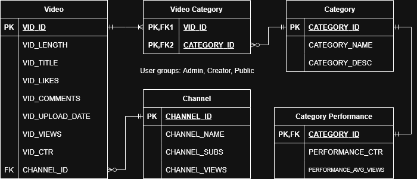

# cop-3710-youtube-analytics
This project uses data from various sources \([Kaggle set 1](https://www.kaggle.com/datasets/datasnaek/youtube-new), [Kaggle set 2](https://www.kaggle.com/datasets/vamshikrishna305/youtube-channel-statistics-dataset)\) 
to find patterns in title length and video category in relation 
to view count and click-through-rate.
The users of this project, mainly YouTube creators, can use this data
to adapt their titles and video types to maximize follower gain.

# Final Database Entity Relationship Diagram

# Final Relational Schema
- Channel (**<u>channel_id</u>**, channel_name, channel_subs, channel_views)
- Video (**<u>vid_id</u>**, vid_length, vid_title, vid_likes, vid_comments, vid_upload_date, vid_views, vid_ctr, *channel_id*)
- Category (**<u>category_id</u>**, category_name, category_desc)
- Video Category (***<u>vid_id</u>***, ***<u>category_id</u>***)
- Category Performance (***<u>category_id</u>***, performance_ctr, performance_avg_views)